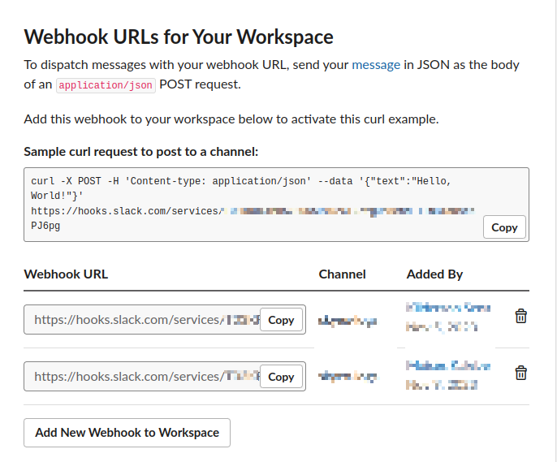
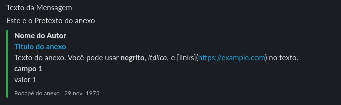

# Slack App Message Dispatcher

## Introdução

Bem-vindo ao Slack App Message Dispatcher, a ferramenta que transforma a comunicação entre desenvolvedores e equipes no Slack em algo extraordinariamente simples e eficaz. Este aplicativo nasceu da necessidade de registrar eventos e notificar o time de maneira personalizada, oferecendo uma solução inovadora para facilitar a vida dos desenvolvedores que buscam uma integração fluida com a plataforma Slack.

Ao refletir sobre a otimização do processo de comunicação, surgiu a ideia de criar um pacote que não apenas simplificasse a notificação de ações nas aplicações, mas também proporcionasse flexibilidade na manipulação das mensagens. O Slack App Message Dispatcher é mais do que uma simples ferramenta; é um facilitador, projetado para tornar a interação entre desenvolvedores e equipes mais ágil e personalizada.

Explore o Slack App Message Dispatcher e descubra como ele pode transformar a forma como sua equipe se comunica no Slack.

## Índice
1. [Introdução](#introdução)
2. [Índice](#indice)
3. [Requisitos](#requisitos)
4. [Instalação](#instalação)
5. [Utilização](#utilização)
6. [Exemplo](#exemplo)
7. [Contribuição](#contribuição)

## Requisitos

Necessario PHP 8.1+

## Instalação

#### Para realizar a instalação desta dependência basta executar o seguinte comando:
```shell
composer require moiseskalebe/slack-dispatcher-php
```

## Utilização
#### Antes de tudo você precisara se direcionar ao [site do slack](https://api.slack.com/apps/{APP_ID}/incoming-webhooks?success=1)e pegar a url do seu app.
#### Apos acessar o site você ira abrir as configurações do seu app e descer ate o final da pagina para a sessão *_Webhook Url_*


#### Apos obter este link do webhook do app você podera prosseguir definindo apenas a conexão e os detalhes da mensagem a ser enviada.

Modelo para setup:
```php
<?php

declare(strict_types=1);

use MoisesK\SlackDispatcherPHP\Attachment;
use MoisesK\SlackDispatcherPHP\Collection\AttachmentFieldCollection;
use MoisesK\SlackDispatcherPHP\MessageDispatcher;
use MoisesK\SlackDispatcherPHP\Dto\AttachmentAuthor;
use MoisesK\SlackDispatcherPHP\Dto\AttachmentField;
use MoisesK\SlackDispatcherPHP\Dto\AttachmentFooter;
use MoisesK\SlackDispatcherPHP\Dto\AttachmentTitle;
use MoisesK\SlackDispatcherPHP\SlackAppMessage;

require __DIR__ . '/vendor/autoload.php';

// Todos os parâmetros do anexo(Attachment) são opcionais.
$attachment = new Attachment([
    'color' => '#36a64f',
    'pretext' => 'Este e o Pretexto do anexo',
    'author' => new AttachmentAuthor(
        authorName: 'Nome do Autor',
        authorIcon: "https://example.com"
    ),
    'title' => new AttachmentTitle(
        title: 'Titulo do anexo',
        titleLink: "https://example.com"

    ),
    'text' => 'Texto do anexo. Você pode usar *negrito*, _itálico_, e [links](https://example.com) no texto.',
    'fields' => new AttachmentFieldCollection([
        new AttachmentField(
            title: 'campo 1',
            value: 'valor 1',
            short: false
        )
    ]),
    'imageUrl' => "https://example.com",
    'footer' => new AttachmentFooter(
        footer: 'Rodapé do anexo',
        footerIcon: "https://example.com"
    ),
    'ts' => '123456789'
]);

// Crie uma instância da classe SlackAppMessage
$slackMessage = new SlackAppMessage('https://hooks.slack.com/services/.....');

// Defina o texto do Cabeçalho da Mensagem
$slackMessage->setHeaderText('Texto da Mensagem');

// Adicione um Anexo
$slackMessage->addAttachment($attachment);

// Envie a mensagem para o app
$slackMessage->dispatch();
```

## Exemplo:
#### Veja um exemplo de como sua mensagem ira ficar:




## Contribuição

A contribuição para este projeto é realizada por meio de Pull Requests (PRs). Antes de enviar uma contribuição, certifique-se de seguir estas etapas:

1. **Faça um Fork do Repositório:**
    - Faça um fork do repositório para a sua conta no GitHub.
    - Clone o repositório forkado para a sua máquina local.

```bash
git clone https://github.com/seu-usuario/[Nome do Seu Projeto].git
```

2. ***Crie uma Branch para sua Contribuição:***
   - Crie uma nova branch para trabalhar na sua contribuição.

```bash
git clone https://github.com/seu-usuario/[Nome do Seu Projeto].git
```

3. ***Faça as Modificações:***
    - Implemente as alterações necessárias no código..

4. ***Teste suas Modificações:***
   - Certifique-se de que suas alterações funcionam conforme o esperado.
   - Execute testes adicionais, se aplicável.

5. ***Envie o Pull Request::***
   - Faça o commit das suas alterações.
   - Envie o Pull Request para o repositório principal.

### Diretrizes do Pull Request
Ao enviar um Pull Request, por favor, siga estas diretrizes:

- Descreva claramente as alterações introduzidas pelo seu Pull Request.
- Inclua informações detalhadas sobre o motivo das alterações.
- Se possível, faça referência a problemas específicos por meio de números de issues.

Para tornar o processo de revisão de Pull Requests mais eficiente, aqui estão algumas preferências pessoais:

- Utilize um estilo de codificação consistente com o restante do projeto.
- Inclua testes unitários para as novas funcionalidades ou correções.
- Mantenha as mensagens de commit claras e concisas.

Happy coding! 🚀